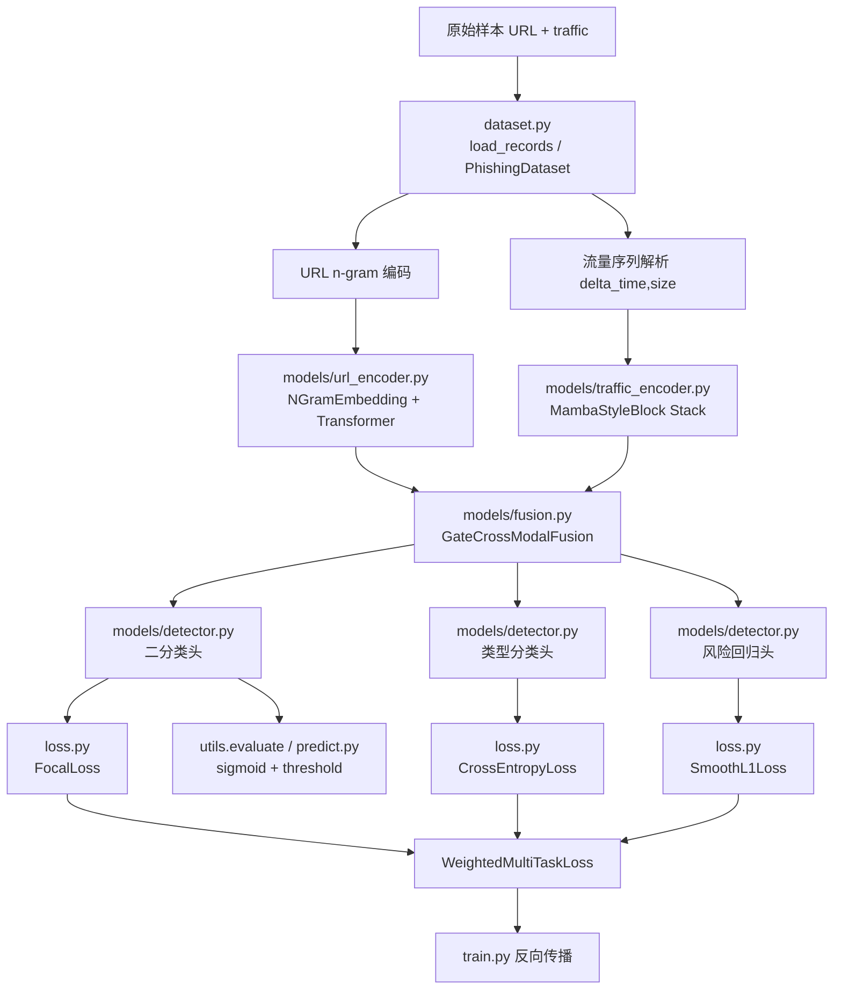

# ALGORITHM_DESIGN_LOGIC_REPORT

## 1. 项目算法系统总览

### 1.1 核心业务目标
该项目当前代码实现的是一个“基于 URL 字符串与流量时序的多模态钓鱼网站检测系统”。系统输出三个结果：

- 二分类结果：是否为钓鱼网站
- 辅助分类结果：钓鱼子类型
- 辅助回归结果：风险分数

从现有代码看，算法系统的职责不是做业务编排，而是直接完成以下算法闭环：

1. 将原始 URL 与流量样本编码为模型输入
2. 通过 URL 编码器和流量编码器提取两路表征
3. 做跨模态融合
4. 输出主任务与辅助任务结果
5. 在训练阶段计算多任务损失
6. 在评估/推理阶段根据阈值完成判定

### 1.2 算法系统在项目中的职责边界
当前仓库没有复杂服务层或外部业务层。算法系统几乎就是项目主体本身，主要边界如下：

- `config.py` 负责参数控制
- `dataset.py` 负责数据读取与算法输入编码
- `models/` 负责核心算法建模
- `loss.py` 负责训练目标定义
- `train.py` / `predict.py` / `evaluate_test.py` 负责算法入口和流程编排
- `utils.py` 负责算法流程共用能力

### 1.3 算法系统整体结构图



### 1.4 从输入到输出的数据流 / 决策流

```text
输入样本
  -> 读取 JSON / JSONL
  -> URL 标准化 + n-gram 切分 + ID 化
  -> traffic 解析为 [delta_time, size]
  -> batch padding + mask 构造
  -> URL 编码器提取 url_repr
  -> 流量编码器提取 traffic_repr
  -> 跨模态融合得到 fused
  -> 输出 logits / type_logits / risk_score
  -> 训练时计算 total loss
  -> 推理/评估时根据 threshold 生成 is_phishing
```

---

## 2. 算法模块清单

| 模块名称 | 文件路径 | 入口函数 / 核心类 | 主要职责 | 上游依赖 | 下游影响 | 重要程度 |
|---|---|---|---|---|---|---|
| 配置系统 | `config.py` | `PhishingConfig`, `get_config` | 提供训练/评估/推理公共参数 | CLI | 所有模块 | 高 |
| 样本读取与编码 | `dataset.py` | `load_records`, `PhishingDataset`, `collate_fn` | 原始样本读取、URL 编码、流量解析、batch 组装 | 数据文件、配置、词表 | 模型输入 | 高 |
| URL 词表构建 | `dataset.py` | `build_ngram_vocab`, `build_url_vocabs` | 生成 1/2/3-gram 词表 | 训练集 URL | URL 编码器输入空间 | 高 |
| URL 序列编码 | `models/url_encoder.py` | `NGramEmbedding`, `URLTransformerEncoder` | URL 多粒度 token 嵌入与 Transformer 编码 | URL token IDs, mask | 融合层 | 高 |
| 流量时序编码 | `models/traffic_encoder.py` | `MambaStyleBlock`, `TrafficMambaEncoder` | 将 `[delta_time, size]` 时序映射为全局表征 | traffic tensor, mask | 融合层 | 高 |
| 跨模态融合 | `models/fusion.py` | `GateCrossModalFusion` | 融合 URL 与流量全局向量 | URL/流量编码器输出 | 三个任务头 | 高 |
| 顶层检测器 | `models/detector.py` | `PhishingDetector` | 封装完整前向逻辑与任务头 | URL/流量编码器、融合层 | 训练、推理、评估 | 高 |
| 多任务损失 | `loss.py` | `FocalLoss`, `WeightedMultiTaskLoss` | 定义主任务与辅助任务目标 | 模型输出、标签 | 参数更新 | 高 |
| 训练流程编排 | `train.py` | `train_one_epoch`, `main` | 训练、验证、checkpoint 保存 | 数据、模型、损失、工具函数 | 模型权重 | 高 |
| 评估流程编排 | `utils.py`, `evaluate_test.py` | `evaluate`, `main` | 指标计算、阈值搜索、测试集评估 | 模型输出 | 评估结果/阈值 | 高 |
| 推理流程编排 | `predict.py` | `load_model_bundle`, `predict_records`, `main` | checkpoint 恢复、批量推理、结果输出 | checkpoint, 数据样本 | 最终预测输出 | 高 |
| 阈值与持久化工具 | `utils.py` | `find_optimal_threshold`, `save_checkpoint`, `load_checkpoint` | 阈值搜索与模型状态保存/恢复 | 验证集概率、模型状态 | 训练/推理一致性 | 中 |
| 模拟数据生成 | `data/generate_mock_data.py` | `generate_split`, `main` | 生成验证流程用的模拟训练数据 | 随机数 | 训练输入数据 | 中 |

---

## 3. 每个算法模块的详细设计逻辑

### 3.1 配置系统

#### 模块目标
统一控制算法行为，包括：

- URL 和流量最大长度
- URL 词表上限
- 模型宽度/深度
- 训练轮次、学习率、权重衰减
- 阈值搜索策略
- checkpoint 与日志路径

#### 设计思路
使用 `@dataclass` 定义静态配置结构，再用 `argparse` 暴露同名命令行参数。这样训练、推理、评估都可以使用同一套配置结构。

#### 输入 / 输出
- 输入：命令行参数
- 输出：`PhishingConfig`

#### 关键参数
- `max_url_len`
- `max_traffic_len`
- `vocab_1gram_max_size` / `vocab_2gram_max_size` / `vocab_3gram_max_size`
- `url_embed_dim` / `traffic_embed_dim` / `fusion_dim`
- `epochs` / `lr` / `weight_decay`
- `threshold_metric`

#### 关系
- 上游：CLI
- 下游：所有算法模块

#### 隐含约束
- 参数命名同时承担“训练配置”和“checkpoint 恢复”的双重语义
- 推理与评估不是实时重新推导参数，而是优先恢复 checkpoint 内配置

#### 证据索引
- `config.py:11` `PhishingConfig`
- `config.py:77` `build_parser`
- `config.py:139` `get_config`

---

### 3.2 数据读取、URL 编码与流量预处理模块

#### 模块目标
把原始样本转换成模型可以直接消费的统一张量格式。

#### 设计思路
数据层集中处理两类异构输入：

- URL：做标准化、n-gram 切分、词表映射
- 流量：转为最小必要二维时序 `[delta_time, size]`

最终由 `collate_fn` 统一做 padding 和 mask 构造。

#### 输入 / 输出
- 输入：JSON/JSONL 样本，字段包括 `url`、`traffic`、`label`、`phish_type`、`risk_score`
- 输出：
  - `ids_1gram`
  - `ids_2gram`
  - `ids_3gram`
  - `traffic_feats`
  - `url_mask`
  - `traffic_mask`
  - 标签字段

#### 核心类、函数、方法
- `load_records`
- `normalize_url`
- `extract_ngrams`
- `build_ngram_vocab`
- `build_url_vocabs`
- `encode_url_to_ngrams`
- `parse_traffic_sequence`
- `PhishingDataset.__getitem__`
- `collate_fn`
- `build_dataloader`

#### 关键参数及含义
- `max_url_len`：URL 截断长度
- `max_traffic_len`：流量时序截断长度
- `min_freq`：n-gram 词表最小频次
- `PAD_ID` / `UNK_ID`：padding 与未知 token 的约定

#### 主要处理流程

```text
for each sample:
  url_text = normalize_url(url)
  grams_1 = extract_ngrams(url_text, 1)
  grams_2 = extract_ngrams(url_text, 2)
  grams_3 = extract_ngrams(url_text, 3)
  ids_k = vocab_lookup(grams_k, UNK_ID)

  traffic_rows = parse_traffic_sequence(raw_traffic)
  sample_dict = {
    ids_1gram, ids_2gram, ids_3gram,
    traffic, label, phish_type, risk_score
  }

batch:
  pad ids_k
  pad traffic
  build url_mask
  build traffic_mask
```

#### 为什么这样设计
- URL 编码器需要离散 token 序列和长度掩码
- 流量编码器不依赖复杂特征工程，只需要最小的时序输入
- 在 `Dataset` 层完成样本级编码，在 `collate_fn` 层完成 batch 级对齐，职责划分清晰

#### 隐藏约束、默认假设、硬编码规则
- `normalize_url` 当前会 `strip().lower()`，即去空白并统一小写
- URL 不足 n 时，直接返回整串作为单个 gram
- 空 URL 会被编码为 `[PAD_ID]`
- 空流量会被编码为 `[[0.0, 0.0]]`
- 如果时间戳下降，`delta_time` 取绝对值并继续累加 `previous_timestamp`

#### 风险与警告
- `normalize_url` 统一小写会抹掉大小写模式信号，属于建模假设而非中性处理
- `parse_traffic_sequence` 对异常时间戳的处理是“兜底式修正”，不是严格时序清洗
- 数据层未对字段完整性做严格 schema 校验，依赖 `dict.get` 默认值回退

#### 证据索引
- `dataset.py:20` `load_records`
- `dataset.py:69` `normalize_url`
- `dataset.py:81` `extract_ngrams`
- `dataset.py:99` `build_ngram_vocab`
- `dataset.py:130` `build_url_vocabs`
- `dataset.py:147` `encode_url_to_ngrams`
- `dataset.py:172` `parse_traffic_sequence`
- `dataset.py:215` `PhishingDataset`
- `dataset.py:287` `collate_fn`
- `dataset.py:321` `build_dataloader`

---

### 3.3 URL 算法模块

#### 模块目标
将 URL 从字符层面的离散序列编码为可用于分类的全局语义向量。

#### 设计思路
URL 使用三种粒度并行建模：

- 1-gram：字符级模式
- 2-gram：局部连续子串模式
- 3-gram：更长局部上下文模式

先做三路 embedding，再通过门控融合，最后交给 Transformer 提取上下文依赖。

#### 输入 / 输出
- 输入：
  - `ids_1gram`
  - `ids_2gram`
  - `ids_3gram`
  - `url_mask`
- 输出：
  - URL 全局向量 `cls_repr`
  - URL 序列表示 `encoded[:, 1:]`

#### 核心类与方法
- `NGramEmbedding`
- `URLTransformerEncoder`
- `_pad_to_length`

#### 关键参数
- `embed_dim`
- `num_heads`
- `num_layers`
- `ff_dim`
- `max_url_len`

#### 主要处理流程

```text
e1 = Embedding(ids_1gram)
e2 = Embedding(ids_2gram)
e3 = Embedding(ids_3gram)

e2/e3 pad_to_length with e1 length
gate = softmax(MLP(concat(e1, e2, e3)))
fused = gate1*e1 + gate2*e2 + gate3*e3

prepend CLS
add position embedding
run TransformerEncoder with src_key_padding_mask
return CLS and token states
```

#### 为什么这样设计
- n-gram 融合保留多尺度字符串模式
- Transformer 提供长程上下文建模
- CLS token 方便与流量模态做全局融合

#### 隐藏约束
- URL 编码器使用可学习的位置参数，不是相对位置编码
- 2-gram / 3-gram 序列长度不足时通过补零右对齐
- 模型 embedding 大小来自“配置上限”，不是“实际词表大小”

#### 风险
- 词表由频次截断，低频恶意 token 可能落入 `UNK_ID`
- 当前实现会丢失 URL 原始大小写差异
- `max_url_len` 改变会同时影响词表编码长度、位置参数和显存占用

#### 证据索引
- `models/url_encoder.py` `NGramEmbedding`
- `models/url_encoder.py` `URLTransformerEncoder`
- `models/url_encoder.py` `_pad_to_length`
- `models/detector.py` `PhishingDetector.__init__`

---

### 3.4 流量时序算法模块

#### 模块目标
从最小化处理后的流量时序中提取全局行为向量。

#### 设计思路
流量侧不做复杂手工特征工程，而是直接处理 `[delta_time, size]` 序列。编码器主体是“线性投影 + 多层 Mamba 风格残差块 + CLS 汇聚”。

#### 输入 / 输出
- 输入：
  - `traffic_feats: [B, T, 2]`
  - `traffic_mask: [B, T]`
- 输出：
  - 全局表征 `sequence[:, 0]`
  - 局部时序表征 `sequence[:, 1:]`

#### 核心类与方法
- `MambaStyleBlock`
- `TrafficMambaEncoder`

#### 关键参数
- `input_dim`
- `embed_dim`
- `num_layers`
- `expand_factor`
- `kernel_size`
- `max_len`

#### 主要处理流程

```text
sequence = Linear(LayerNorm(traffic_feats))
prepend CLS
add learned position embedding

for block in blocks:
  residual = x
  x = LayerNorm(x)
  values, gates = Linear(x).chunk(2)
  values = depthwise_conv(values)
  values = values + tanh(state_proj(values))
  x = residual + out_proj(silu(values) * sigmoid(gates))
  x = x * mask

output_norm(x)
return CLS, sequence_states
```

#### 为什么这样设计
- 输入维度极小，线性投影即可进入隐藏空间
- depthwise 1D conv 提供局部时序建模能力
- gate 机制和残差结构改善稳定性
- CLS token 允许后续用统一方式与 URL 模态对接

#### 隐藏约束
- `mask` 乘在 block 输出而不是注意力分数上
- 时序模型不是标准 Mamba 实现，而是“Mamba 风格近似块”
- `max_len` 既决定位置参数大小，也限制可处理时序长度

#### 风险
- 深度卷积核固定，无法自适应多尺度流量模式
- 对超长流量样本的截断可能损失后段行为
- 对空流量样本的编码几乎退化为默认模板

#### 证据索引
- `models/traffic_encoder.py` `MambaStyleBlock`
- `models/traffic_encoder.py` `TrafficMambaEncoder`
- `dataset.py` `parse_traffic_sequence`
- `models/detector.py` `PhishingDetector.__init__`

---

### 3.5 跨模态融合模块

#### 模块目标
把 URL 全局向量和流量全局向量融合成统一的任务特征。

#### 设计思路
先把两路向量映射到同一维度，再用门控控制两模态相对占比，并显式加入逐维交互项。

#### 输入 / 输出
- 输入：
  - `url_repr`
  - `traffic_repr`
- 输出：
  - `fused hidden state`

#### 核心类与方法
- `GateCrossModalFusion.forward`

#### 关键参数
- `url_dim`
- `traffic_dim`
- `hidden_dim`
- `dropout`

#### 处理流程

```text
url_state = url_proj(url_repr)
traffic_state = traffic_proj(traffic_repr)
gate = sigmoid(MLP(concat(url_state, traffic_state)))
fused = gate * url_state + (1 - gate) * traffic_state
interaction = url_state * traffic_state
output = output_mlp(concat(fused, interaction))
```

#### 为什么这样设计
- 不是简单拼接，而是允许模型自动调整两模态主次
- 显式交互项增强模态间耦合表达

#### 隐藏约束
- 融合仅发生在全局向量层面，不做 token-level 或 step-level cross attention
- 交互项使用 Hadamard 乘积，表达能力受限于同维映射后的逐维关系

#### 风险
- 若某一模态质量明显更差，门控可能长期偏向另一侧，导致弱模态被边缘化
- 没有直接暴露 gate 供监控，融合行为可观测性偏弱

#### 证据索引
- `models/fusion.py` `GateCrossModalFusion`
- `models/detector.py` `PhishingDetector.forward`

---

### 3.6 顶层检测器模块

#### 模块目标
封装完整多模态前向路径，并输出主任务与辅助任务结果。

#### 设计思路
顶层模型不承担数据清洗，只负责串联编码器、融合层和三个头：

- `binary_head`
- `type_head`
- `risk_head`

#### 输入 / 输出
- 输入：
  - URL token IDs
  - URL mask
  - traffic features
  - traffic mask
- 输出：
  - `logits`
  - `main_logits`
  - `type_logits`
  - `risk_score`
  - `pred`

#### 隐含设计点
- `main_logits` 实际与 `logits` 相同，都是单标量二分类 logit，不是双类 logits
- `pred` 固定使用 `0.5` 阈值，而不是外部传入阈值

#### 风险
- 命名 `main_logits` 容易让后续分析者误判为 shape `[B, 2]`
- `pred` 与外部阈值逻辑解耦，可能与 `predict.py`、`utils.evaluate` 使用的 threshold 产生认知偏差

#### 证据索引
- `models/detector.py` `PhishingDetector`
- `predict.py` `predict_records`
- `utils.py` `evaluate`

---

### 3.7 损失函数模块

#### 模块目标
将二分类主任务与两个辅助任务组合为统一优化目标。

#### 设计思路
- 主任务：`FocalLoss`
- 辅助分类：`CrossEntropyLoss`
- 辅助回归：`SmoothL1Loss`

#### 输入 / 输出
- 输入：
  - 模型输出字典
  - batch 标签字典
- 输出：
  - `main`
  - `type`
  - `risk`
  - `total`

#### 关键参数
- `lambda_main`
- `beta_type`
- `gamma_risk`
- `focal_alpha`
- `focal_gamma`

#### 风险
- 三任务权重为静态常数，没有 warmup 或自适应策略
- 风险回归头已经 `sigmoid`，再配 `SmoothL1Loss`，数值空间被限制在 `[0, 1]`

#### 证据索引
- `loss.py` `FocalLoss`
- `loss.py` `WeightedMultiTaskLoss`
- `loss.py` `build_criterion`

---

### 3.8 训练、评估与推理编排模块

#### 模块目标
把“数据 -> 模型 -> 损失/指标 -> 输出”串成可执行流程。

#### 训练设计逻辑
- 基于训练集动态构建 URL 词表
- 训练中每个 epoch 后在验证集上重新评估
- 使用 AUC 选择最佳 checkpoint
- 阈值在验证时可自动搜索

#### 推理设计逻辑
- 从 checkpoint 恢复模型、配置、词表
- 对输入样本做与训练一致的数据编码
- 使用 checkpoint 中记录的 threshold 作为默认阈值

#### 评估设计逻辑
- 与推理相同地恢复 checkpoint
- 通过 `utils.evaluate` 统一评估逻辑

#### 风险
- `predict_records` 一次性把所有记录拼成单个 batch，没有按 `batch_size` 分块，批量预测存在内存风险
- `utils.evaluate` 会返回大量原始数组，若数据量很大，结果对象会变重

#### 证据索引
- `train.py` `main`, `train_one_epoch`
- `predict.py` `load_model_bundle`, `predict_records`, `main`
- `evaluate_test.py` `main`
- `utils.py` `evaluate`, `save_checkpoint`, `load_checkpoint`

---

## 4. 核心算法流程拆解

### 4.1 数据读取
- 做了什么：
  - 从 JSON 数组或 JSONL 读取样本
- 为什么需要：
  - 为统一支持训练数据、测试数据和临时样本文件
- 输入输出变化：
  - 文件文本 -> Python `List[Dict]`
- 显著影响参数：
  - 无显式参数，但依赖输入格式
- 脆弱点：
  - schema 校验弱，字段缺失主要靠默认值兜底

### 4.2 数据清洗/预处理
- 做了什么：
  - URL 去空白并统一小写
  - traffic 解析为 `[delta_time, size]`
- 为什么需要：
  - 规范 URL token 化输入
  - 将异构流量样本统一成固定二维时序格式
- 输入输出变化：
  - 原始 `url` -> 标准化 URL 字符串
  - 原始 `traffic` -> 形状 `[T, 2]` 的浮点张量
- 影响结果的关键参数：
  - `max_url_len`
  - `max_traffic_len`
- 最脆弱步骤：
  - `normalize_url` 的小写化会改变特征分布
  - 异常时间戳的修正逻辑比较粗糙

### 4.3 特征构造
- 做了什么：
  - 1/2/3-gram 提取与词表映射
- 为什么需要：
  - 将 URL 离散字符串结构转成可学习 token 序列
- 输入输出变化：
  - 字符串 URL -> 三组离散 token ID
- 显著影响参数：
  - 三套词表大小
  - `ngram_min_freq`
- 最脆弱步骤：
  - 低频 token 被压缩为 `UNK`

### 4.4 模型执行
- 做了什么：
  - URL 编码 -> 流量编码 -> 融合 -> 三头输出
- 为什么需要：
  - 分离建模两模态，再在高层组合
- 输入输出变化：
  - 多模态 batch 张量 -> logits / 辅助输出
- 显著影响参数：
  - `url_embed_dim`
  - `traffic_embed_dim`
  - `fusion_dim`
  - URL/流量编码层数
- 最脆弱步骤：
  - 融合层仅用全局向量，不建模更细粒度模态交互

### 4.5 打分 / 决策
- 做了什么：
  - `sigmoid(logits)` 转概率
  - 结合 threshold 生成二分类结果
- 为什么需要：
  - 训练输出与实际分类决策解耦
- 输入输出变化：
  - raw logits -> 概率 -> 标签
- 显著影响参数：
  - `threshold`
  - `threshold_metric`
- 最脆弱步骤：
  - 内部 `pred` 固定 0.5 与外部 threshold 并不严格统一

### 4.6 后处理与输出
- 做了什么：
  - 保存 checkpoint
  - 保存预测 JSON
  - 保存评估指标 JSON
- 为什么需要：
  - 支持离线分析、推理复现和模型复用
- 最脆弱步骤：
  - checkpoint 中保存了配置和词表，若未来结构变更，兼容性需要额外控制

---

## 5. 配置与参数系统

### 5.1 哪些配置影响算法行为

高影响参数：

- URL 输入：
  - `max_url_len`
  - `vocab_1gram_max_size`
  - `vocab_2gram_max_size`
  - `vocab_3gram_max_size`
  - `ngram_min_freq`
- 模型结构：
  - `url_embed_dim`
  - `url_num_heads`
  - `url_num_layers`
  - `traffic_embed_dim`
  - `traffic_num_layers`
  - `traffic_expand_factor`
  - `traffic_kernel_size`
  - `fusion_dim`
- 训练：
  - `epochs`
  - `lr`
  - `weight_decay`
  - `grad_clip`
  - `patience`
  - `loss_beta`
  - `loss_gamma`
  - `focal_alpha`
  - `focal_gamma`
- 决策：
  - `threshold_metric`

### 5.2 配置从哪里加载
- 默认值定义在 `config.py:11` `PhishingConfig`
- CLI 覆盖在 `config.py:77` `build_parser`
- 训练时由 `train.py` 调用 `get_config`
- 推理/评估优先从 checkpoint 恢复 `config`

### 5.3 覆盖默认值的方式
- 训练：命令行参数覆盖 dataclass 默认值
- 推理/评估：checkpoint 中保存的 `config` 作为主来源，运行参数只覆盖少数字段，如：
  - `test_path`
  - `threshold`
  - `device`

### 5.4 关键耦合关系

#### 耦合 1：`max_url_len`
同时影响：

- `dataset.encode_url_to_ngrams`
- `models.URLTransformerEncoder.position`

#### 耦合 2：词表大小
同时影响：

- `build_ngram_vocab`
- `Embedding` 层大小

#### 耦合 3：`max_traffic_len`
同时影响：

- `parse_traffic_sequence`
- `TrafficMambaEncoder.position`

#### 耦合 4：`threshold_metric`
影响：

- `utils.find_optimal_threshold`
- `utils.evaluate`
- 最佳 checkpoint 中保存的阈值语义

### 5.5 可能冲突或漂移的点
- checkpoint 恢复的配置与当前 CLI 默认值可能不同
- 文档中“大小写保留”的表述与当前 `normalize_url(...).lower()` 实现不一致
- `pred` 的固定 0.5 与外部 threshold 机制并存

---

## 6. 调用链与依赖关系

### 6.1 算法入口在哪里
- 训练入口：`train.py:62` `main`
- 推理入口：`predict.py:125` `main`
- 评估入口：`evaluate_test.py:36` `main`
- 数据生成入口：`data/generate_mock_data.py:144` `main`

### 6.2 关键调用链路

#### 训练调用链

```text
train.main
  -> get_config
  -> load_records(train/val)
  -> build_url_vocabs
  -> build_dataloader
  -> PhishingDetector(...)
  -> build_criterion
  -> train_one_epoch
       -> move_batch_to_device
       -> model.forward
            -> URLTransformerEncoder.forward
                 -> NGramEmbedding.forward
            -> TrafficMambaEncoder.forward
                 -> MambaStyleBlock.forward
            -> GateCrossModalFusion.forward
       -> WeightedMultiTaskLoss.forward
  -> evaluate
  -> save_checkpoint
```

#### 推理调用链

```text
predict.main
  -> parse_args
  -> load_model_bundle
       -> load_checkpoint
       -> PhishingConfig.from_dict
       -> PhishingDetector(...)
  -> load_records or single-record build
  -> predict_records
       -> PhishingDataset
       -> collate_fn
       -> model.forward
       -> sigmoid + argmax + threshold
  -> save_json / print
```

### 6.3 模块依赖图

```text
config.py
  -> dataset.py
  -> train.py / predict.py / evaluate_test.py
dataset.py
  -> train.py / predict.py / evaluate_test.py
models/url_encoder.py
models/traffic_encoder.py
models/fusion.py
  -> models/detector.py
models/detector.py
  -> train.py / predict.py / evaluate_test.py
loss.py
  -> train.py / evaluate_test.py
utils.py
  -> train.py / predict.py / evaluate_test.py
```

### 6.4 依赖问题判断
- 未发现循环 import
- 存在一定的跨层依赖：
  - 顶层脚本直接依赖数据细节、模型细节和工具细节
- 耦合偏深位置：
  - `predict.py` 和 `evaluate_test.py` 都显式依赖 checkpoint 内部结构字段名

---

## 7. 设计假设、边界与风险

### 7.1 业务与数据假设
- 假设所有样本都能表示成 `url + traffic + label`
- 假设 URL 适合做字符级 n-gram 建模
- 假设流量最低限特征只需 `delta_time` 和 `size`
- 假设风险分数本身可映射到 `[0, 1]`

### 7.2 依赖的数据前提
- 训练集 URL 足以构建有效词表
- traffic 中时间戳和包长字段可被强制转换为浮点数
- `phish_type` 和 `risk_score` 可缺省回退，但语义上默认值未必总合理

### 7.3 风险点清单

1. `dataset.py:69` `normalize_url` 会统一小写  
   - 风险类型：正确性 / 可扩展性  
   - 风险说明：直接抹掉 URL 大小写模式信号，且与当前项目文档表述不一致。

2. `models/detector.py` 中 `pred` 固定使用 0.5  
   - 风险类型：正确性 / 可维护性  
   - 风险说明：与 `predict.py`、`utils.evaluate` 外部阈值策略不是同一机制，容易导致理解偏差。

3. `predict.py:69` `predict_records` 单批推理全部样本  
   - 风险类型：性能 / 稳定性  
   - 风险说明：大批量输入可能导致显存或内存峰值过高。

4. `dataset.py:172` `parse_traffic_sequence` 对异常时间戳做绝对值修正  
   - 风险类型：正确性  
   - 风险说明：这是容错策略，不一定符合真实网络时序语义。

5. `loss.py:47` 静态多任务权重  
   - 风险类型：稳定性 / 可维护性  
   - 风险说明：主任务与辅助任务重要性固定，缺乏任务平衡调度。

6. `models/fusion.py` 只做全局向量融合  
   - 风险类型：可扩展性  
   - 风险说明：无法建模 URL token 与流量 step 之间的细粒度对应关系。

7. `utils.py:139` `evaluate` 返回原始 `labels/probs/preds` 数组  
   - 风险类型：性能 / 可维护性  
   - 风险说明：大数据量评估时结果对象偏重。

### 7.4 训练与推理一致性检查

#### 一致的部分
- 都使用 checkpoint 中的配置恢复模型
- 都使用相同的 `dataset.py` 编码逻辑
- 都依赖同一份 URL 词表

#### 需要重点标出的不一致点
- 模型内部 `pred` 的 0.5 阈值，与外部评估/推理使用的阈值参数不是同一套决策逻辑
- 文档中曾改为“保留原始大小写”，但当前代码仍统一小写

### 7.5 多版本并存情况
从当前有效代码路径看，没有多个并行算法实现同时生效。当前实际生效路径只有一套：

- `dataset.py` URL n-gram + 流量 `[delta_time, size]`
- `models/` 多模态检测器
- `loss.py` 多任务损失

但从仓库现有文档变更痕迹可以判断，文档表述和代码实现已出现局部漂移。

---

## 8. 技术债与优化建议

### 8.1 优化建议清单

1. **P0** 将 URL 标准化策略与文档结论对齐  
   - 对应位置：`dataset.py:69` `normalize_url`  
   - 问题：当前统一小写会丢失大小写模式信息，并与文档不一致。  
   - 优先级：P0

2. **P0** 统一阈值决策逻辑  
   - 对应位置：`models/detector.py`, `predict.py`, `utils.py`  
   - 问题：内部 `pred` 固定 0.5，外部又有可变 threshold。  
   - 优先级：P0

3. **P1** 为 `predict_records` 增加分批推理  
   - 对应位置：`predict.py:69`  
   - 问题：当前对所有 records 一次性 `collate_fn`。  
   - 优先级：P1

4. **P1** 明确 `main_logits` 命名语义  
   - 对应位置：`models/detector.py`  
   - 问题：命名暗示可能是双类 logits，但实际是单标量。  
   - 优先级：P1

5. **P1** 将数据 schema 校验前置  
   - 对应位置：`dataset.py`  
   - 问题：当前依赖 `dict.get` 和默认值，输入不规范时不易早失败。  
   - 优先级：P1

6. **P1** 增强融合层可观测性  
   - 对应位置：`models/fusion.py`  
   - 问题：门控权重不暴露，不便分析模态偏置。  
   - 优先级：P1

7. **P2** 引入任务权重调度  
   - 对应位置：`loss.py`  
   - 问题：静态损失权重可能不适配不同训练阶段。  
   - 优先级：P2

8. **P2** 评估结果对象瘦身  
   - 对应位置：`utils.py:139`  
   - 问题：无条件返回 `labels/probs/preds`，对大规模评估不友好。  
   - 优先级：P2

### 8.2 代码层面的技术债
- 参数分布在 `config.py`、脚本入口、checkpoint 恢复三处，存在语义漂移风险
- 脚本层直接依赖 checkpoint 内字段结构，抽象层次较浅
- 模型输出字段命名部分存在歧义
- 数据层容错逻辑多于显式约束逻辑

---

## 9. 仍不确定的点

1. **不确定点**：为什么 URL 必须统一小写  
   - 原因：代码实现是 `strip().lower()`，但仓库文档表述已经倾向保留大小写。  
   - 代码线索：`dataset.py:69` `normalize_url`。  
   - 还需信息：设计说明、实验记录或提交历史。

2. **不确定点**：`MambaStyleBlock` 是否有意替代标准 Mamba  
   - 原因：实现是“Mamba 风格块”，但并非标准 SSM/Mamba 公式。  
   - 代码线索：`models/traffic_encoder.py` `MambaStyleBlock`。  
   - 还需信息：设计文档或原始模型选型说明。

3. **不确定点**：风险分数标签的业务语义是否严格是 `[0,1]`  
   - 原因：模型头用了 `sigmoid`，但训练数据来源若变化，可能并不满足该约束。  
   - 代码线索：`models/detector.py` `risk_head` 输出后 `sigmoid`；`loss.py` `SmoothL1Loss`。  
   - 还需信息：标签定义协议或数据集说明。

4. **不确定点**：AUC 是否一定是最优 checkpoint 的最终选择标准  
   - 原因：代码中用 AUC 保存最佳模型，但阈值优化指标由 `threshold_metric` 控制。  
   - 代码线索：`train.py` 中 `best_auc` 与 `utils.find_optimal_threshold`。  
   - 还需信息：训练策略约定或实验目标优先级。

---

## 10. 给下一位分析者的摘要

### 10.1 最核心的算法主线
最核心主线是：

`URL n-gram 编码 -> URL Transformer -> 流量最小特征解析 -> Mamba 风格时序编码 -> 跨模态门控融合 -> 二分类/类型分类/风险回归`

### 10.2 最值得重点审查的模块
- `dataset.py`
- `models/url_encoder.py`
- `models/traffic_encoder.py`
- `models/fusion.py`
- `models/detector.py`

### 10.3 最可能存在设计风险的 5 个点
1. URL 统一小写导致信号损失
2. 内外部阈值逻辑不统一
3. 批量推理不分块
4. 流量异常时间戳处理语义较弱
5. 多任务权重固定且无调度

### 10.4 最值得优化的 5 个点
1. 对齐 URL 大小写处理策略
2. 统一并显式化 threshold 决策接口
3. 推理阶段增加 batch/chunk
4. 提升输入 schema 校验与错误可观测性
5. 提升融合层与多任务训练的可解释性

### 10.5 建议下一步深入分析顺序
1. 先审查 `dataset.py` 与 `normalize_url` 的数据分布影响
2. 再审查 `models/url_encoder.py` 与 `models/traffic_encoder.py` 的表征能力
3. 再审查 `models/fusion.py` 是否成为性能瓶颈
4. 再检查 `loss.py` 中多任务权重与训练稳定性
5. 最后统一审查 `train.py`、`predict.py`、`evaluate_test.py` 的阈值与 checkpoint 语义

### 10.6 覆盖说明
本报告已覆盖当前代码库中实际生效的核心算法路径、参数系统、入口脚本、调用链和主要风险点。未深入覆盖的部分主要是：

- 真实线上业务上下文
- 训练数据来源与标签定义协议
- 历史版本演进信息
- 非算法层面的部署与服务化问题
